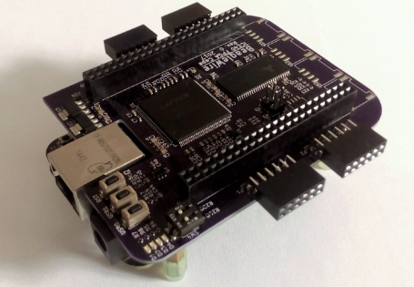

# Getting BBB Ready for BeagleWire

## BeagleWire:

<p align="center">
    
</p>

## 1) Flashing BeagleBone Black With New Image

- First of all download this image from beagleboard site: [AM3358 Debian 10.3 2020-04-06 4GB SD IoT](https://debian.beagleboard.org/images/bone-debian-10.3-iot-armhf-2020-04-06-4gb.img.xz)
- Mount the sdcard
- Decompress the .xz file
    > xz -d BBB*.xz
- This gives you the image file: BBB*.img. Write the image to the memory card 
    > sudo dd if=./BBB*.img of=/dev/sdX

### Booting from SD Card:

- GPMC has been used to transfer the data between FPGA cape and ARM.
- **GPMC and EMMC pins are multiplexed**, so if one needs to use GPMC then BBB should be booted from **SD Card Only.**

- For details steps once can follow below tutorials:
    1. [Booting your BeagleBone board from a SD card](https://subscription.packtpub.com/book/hardware_and_creative/9781785285059/1/ch01lvl1sec14/booting-your-beaglebone-board-from-a-sd-card)
    2. [Derekmolly's tutorial](http://derekmolloy.ie/write-a-new-image-to-the-beaglebone-black/)
    3. [Adafruit tutorial](https://learn.adafruit.com/beaglebone-black-installing-operating-systems/flashing-the-beaglebone-black)


---

## 2) Upgrade the software on your Beagle

### Connect BeagleBoard to the internet
- For detailed steps you can follow this: [Get connected to the Internet](https://beagleboard.org/upgrade#:~:text=There%20are%204%20main%20steps,up%20scripts%20and%20Linux%20kernel&text=Update%20examples%20in%20the%20Cloud9%20IDE%20workspace)

### Update the boot-up scripts and Linux kernel
```
cd /opt/scripts
git pull
sudo tools/update_kernel.sh
sudo shutdown -r now
```
### Update distribution components
```
sudo apt update
sudo apt upgrade
```
### Addition References: [Upgrade the software on your Beagle](https://beagleboard.org/upgrade#:~:text=There%20are%204%20main%20steps,up%20scripts%20and%20Linux%20kernel&text=Update%20examples%20in%20the%20Cloud9%20IDE%20workspace)


---

## 3) Installing Linux Headers
```
sudo apt update
sudo apt install linux-headers-$(uname -r)
```

---
## 4) Getting BeagleWire Software:

> git clone https://github.com/BeagleWire/BeagleWire 


---
## 5) Device Tree Overlay:
- Device Tree is required for enabling SPI and GPMC.

- Compile the dts file and paste it to /lib/firmware
```
cd BeagleWire
dtc -O dtb -o DTS/BW-ICE40Cape-00A0.dtbo -b 0 -@ DTS/BW-ICE40Cape-00A0.dts && sudo cp DTS/BW-ICE40Cape-00A0.dtbo /lib/firmware
```
- Adding device tree Overlay in boot files : 
`sudo vim /boot/uEnv.txt`

- Find the following part: (**Disabling boot from emmc to use GPMC on the FPGA Cape**)

```
###Additional custom capes
#uboot_overlay_addr4=/lib/firmware/<file4>.dtbo
enable_uboot_cape_universal=1
#disable_uboot_overlay_emmc=1
#disable_uboot_overlay_audio=1
#disable_uboot_overlay_wireless=1
```

- Instead add this

```
###Additional custom capes
uboot_overlay_addr4=/lib/firmware/BW-ICE40Cape-00A0.dtbo
#enable_uboot_cape_universal=1
disable_uboot_overlay_emmc=1
disable_uboot_overlay_audio=1
disable_uboot_overlay_wireless=1
```

- Reboot: `sudo reboot`

---
## 6) Writing EEPROM configuration contents

- BeagleWire cape has a EEPROM memory, so that the BBB device overlay is automatically loaded up on each boot up. EEPROM contents and loading script are located in BeagleWire software repository.

```
cd BeagleWire/EEPROM_Cape/
sudo ./load_eeprom.sh
```
---
## 7) LED Blinking:
- Building Custom LKM module
    ```
    cd BeagleWire/load_fw/
    make    #This Make the LKM module for loading beaglewire with bitstream
    ./bw-prog.sh blink.bin
    ```
- To check how programming is proceeding, use:
    ```
    dmesg
    ```
- Results Should Like this:
    ```
    [ 2427.827170] Starting FPGA loader 
    [ 2427.830561] fpga_manager fpga0: writing blink.bin to Lattice iCE40 FPGA Manager
    [ 2428.012162] Stopping FPGA loader     
    ```