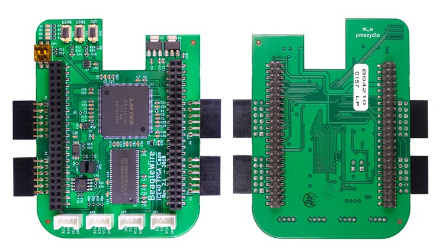

# Getting BBB Ready for BeagleWire


<p align="center">
    
</p>

## 1) Flashing BeagleBone Black With New Image

- First of all download this image from beagleboard site: [AM3358 Debian 10.3 2020-04-06 4GB SD IoT](https://debian.beagleboard.org/images/bone-debian-10.3-iot-armhf-2020-04-06-4gb.img.xz)
- Using this tool flash the SD_card: [balena-etcher](https://www.balena.io/etcher/)

### Booting from SD Card:

- GPMC has been used to transfer the data between FPGA cape and ARM.
- **GPMC and EMMC pins are multiplexed**, so if one needs to use GPMC then BBB should be booted from **SD Card Only.**

- For details steps once can follow below tutorials:
    1. [Derekmolly's tutorial](http://derekmolloy.ie/write-a-new-image-to-the-beaglebone-black/)

---

## 2) Upgrade the software on your Beagle

### Connect BeagleBoard to the internet
- For detailed steps you can follow this: [Get connected to the Internet](https://beagleboard.org/upgrade#:~:text=There%20are%204%20main%20steps,up%20scripts%20and%20Linux%20kernel&text=Update%20examples%20in%20the%20Cloud9%20IDE%20workspace)

### Update the boot-up scripts and Linux kernel
```
cd /opt/scripts
git pull
sudo tools/update_kernel.sh
sudo shutdown -r now
```
### Update distribution components
```
sudo apt update
sudo apt upgrade
```
### Addition References: [Upgrade the software on your Beagle](https://beagleboard.org/upgrade#:~:text=There%20are%204%20main%20steps,up%20scripts%20and%20Linux%20kernel&text=Update%20examples%20in%20the%20Cloud9%20IDE%20workspace)


---

## 3) Installing Linux Headers and Flashrom
```
sudo apt install linux-headers-$(uname -r) #Needed to directly program FPGA
sudo apt-get install flashrom #Needed to program FPGA using spi method
```

---
## 4) BeagleWire Software:

```
 # Recommended to clone both on host and BBB
 git clone https://github.com/BeagleWire/BeagleWire 
 git checkout testing   
```
---
## 5) Device Tree Overlay and uEnv.txt:

- Device Tree Overlay is required for initializing the spidev to program the FPGA and gpmc to communicate with FPGA for data transfer.

```
git clone https://github.com/BeagleWire/BeagleBoard-DeviceTrees
cd BeagleBoard-DeviceTrees
make
sudo cp src/arm/overlays/BW-ICE40Cape-00A0.dtbo /lib/firmware
sudo cp src/arm/overlays/BW-ICE40Cape-00A0_LKM.dtbo /lib/firmware

#  Create dtb backup:
sudo cp /boot/dtbs/4.19*/am335x-boneblack-uboot-univ.dtb am335x-boneblack-uboot-univ.dtb.backup

# Install the new dtb:
cd BeagleBoard-DeviceTrees
sudo cp src/arm/am335x-boneblack-uboot-univ.dtb /boot/dtbs/4.19*/
```

- Some of the things needs to be disabled in uEnv.txt to run the FPGA:
- Find the following part: (Disabling boot from emmc to use GPMC on the FPGA Cape)

```
enable_uboot_cape_universal=1 #Keep Cape Universal Enabled
#disable_uboot_overlay_emmc=1
#disable_uboot_overlay_video=1
#disable_uboot_overlay_audio=1
#disable_uboot_overlay_wireless=1
#disable_uboot_overlay_adc=1
```
- Instead add this

```
enable_uboot_cape_universal=1 #Keep Cape Universal Enabled
disable_uboot_overlay_emmc=1
disable_uboot_overlay_video=1
disable_uboot_overlay_audio=1
disable_uboot_overlay_wireless=1
disable_uboot_overlay_adc=1
```
- Sample uEnv.txt: [reference](https://pastebin.pl/view/5282b9df)

---
## 6) Writing EEPROM configuration contents

- BeagleWire cape has a EEPROM memory, so that the BBB device overlay is automatically loaded up on each boot up. 
- EEPROM contents and loading script are located in BeagleWire software repository.
- **So once we program the eeprom, then we don't have to explicitly add overlay info in uEnv.txt at any addr4**
- If `BW-ICE40Cape-00A0.dtbo` is present in /lib/firmware then it will be automatically loaded.

```
cd BeagleWire/EEPROM_Cape/
sudo ./load_eeprom.sh
```
---
## 7) Programming BeagleWire:
- There are two ways to program the FPGA:
    1. First we program the onboard SPI flash, after reset the fpga is booted from spi flash. Even after power cut the program is retain.
    (**Overlay: BW_ICE40Cape_00A0.dtbo**)
    2. Directly programmnig the FPGA using custom LKM, in this method FPGA is directly programmed with bitstream and after power cut program is no longer exist. (**Overlay: BW_ICE40Cape_00A0_LKM.dtbo**)


- First of all add following lines in `.bashrc` at the end, so that those scripts can be run from anywhere.
- `vim /home/debian/.bashrc`

```
# To run beaglewire script from anywhere
 export PATH=$PATH:/home/debian/BeagleWire/load_fw
```

- Build LKM and make executable the load_fw directory beforehand:
```
cd BeagleWire/bridge_lib
make #Build the memmap and other bridge files
cd BeagleWire/load_fw
make #Builds the lkm
chmod +x * #Make the scripts and spi test executable
```

- There are several ways for programming bitstream into BeagleWire:


## 1) Flashing the sram on beaglewire with bitstream: (simplest way)

```
    sudo su
    source .bashrc 
    bw-spi.sh <bin file to program>
    #Example: bw-spi.sh blink.bin
``` 

## 2) LKM module with the ice40-spi kernel driver:

- For this you need to load following DTS file into `uEnv.txt`

```
    sudo vim /boot/uEnv.txt
    
    #Add this overlay line at addr0 place:
    #If we had added the overlay at addr4, bbb automatically will add BW-ICE40Cape-00A0.dtbo overlay
    #So to override that file we need to add this at addr0
    
    uboot_overlay_addr0=/lib/firmware/BW-ICE40Cape-00A0_LKM.dtbo 
    
    #Disable the cape universal
    #enable_uboot_cape_universal = 1

    #Reboot after this
``` 

- `bw-prog.sh blink.bin` 
- Using this way one can program any bitstream directly to the FPGA via ice40-spi kernel driver and LKM module.
