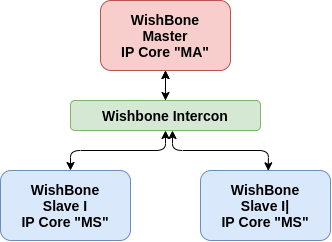

<h1 align="center">
    <b>Project Report for GSoC 2021</b> 
</h1>

## BeagleWire - FPGA development cape for the BeagleBone Black

<p align="center">
    
</p>

## Table of Contents
- [BeagleWire](#beaglewire---fpga-development-cape-for-the-beaglebone-black)
  - [About](#about)
  - [Introduction](#introduction)
  - [Work Done](#work-done)
    - [1. Programming BeagleWire](#1-programming-beaglewire)
    - [2. Communication between BeagleWire and BBB](#2-communication-between-beaglewire-and-bbb)
    - [3. Wishbone Examples with Intercon support](#3-wishbone-examples-with-intercon-support)
    - [4. Litex Core: Award Winning Serv + LiteDRAM + UART Wisbone Crossover](#4-litex-core-award-winning-serv--litedram--uart-wisbone-crossover)
    - [5. PMOD support of BeagleWire](#5-pmod-support-of-beaglewire)
    - [6. Increase Documentation](#6-increase-documentation)
  - [Github Issue List](#github-issue-list)
  - [PR Status](#pr-status)
  - [Future Improvements](#future-improvements)
  - [References and Acknowledgements](#references-and-acknowledgements)
  - [Benefits](#benefits)
  - [Contributors](#contributors)

## **About**

**About Student**: [Omkar Bhilare](https://omkarbhilare.tech) <br>
**Mentors**: Michael Welling, Stephen Arnold<br>
**Code**: [BeagleWire Code](https://github.com/BeagleWire/BeagleWire) | **Docs**: [BeagleWire Software](https://beaglewire.github.io/) | **GSoC**: [BeagleWire GSoC Project](https://summerofcode.withgoogle.com/projects/#4845032915337216) <br>
**Proposal**: [BeagleWire Software](https://elinux.org/BeagleBoard/GSoC/2021_Proposal/OmkarBhilare) <br>

## **Introduction:**

- The BeagleWire is an FPGA development platform that has been designed for use with BeagleBone boards. BeagleWire is a cape on which there is an FPGA device (Lattice iCE40HX). The software support for BeagleWire was still in the development phase. But now it is stable, you can check it [here](https://github.com/BeagleWire/BeagleWire)
- iCE40 is an energy saving device, allowing to work with small batteries. FPGA cape allows easy and low cost start for beginners who would like to take their first steps in working with FPGAs. 
- In this project, I was developing and testing the existing software support of Beaglewire. The known primary issue in Beaglewire was the interface between 32MB SDRAM and ICE40HX4K. For this Solution, I tried a FPGA proven solution like LiteDRAM(a small footprint and configurable DRAM core).
- There are current Issues open on BeagleWire Repository, These were solved during this project.
- More PMODs are interfaced with the BeagleWire now.
- Increased the Documentation and also added new programming method for FPGA with proper starting guide for new user who wants to experiment with BeagleWire.
- In this project I was going to test all the subsystems like I2C, SPI, PWM, UART in Hardware and the primary goal will be to debug the issues related to them and fix them accordingly. 

---

## **Work Done:**

### **1. Programming BeagleWire:**

<p align="center">
    
</p>

-  The BeagleWire Programming Method are as follows:

1. **SPI Flash method:**
    - First we program the BeagleWire onboard SPI flash. After FPGA is reset, it is booted from spi flash. Even after power cut the program is retain. (**Overlay File Name**: BW_ICE40Cape_00A0.dtbo)
    - For this method, I have used **flashrom** which is a utility for identifying, reading, writing, verifying and erasing flash chips.
    - The flow is  we program the spi flash using flashrom with the help of spidev, then we tristate the spi lines from BeagleBone black so on the reboot FPGA can boot from spi flash and run the bitstream.
    - To change the pinmode on the go, I have used `config-pin` utility and for GPMC I have added special modes in the boneblack dtsi file.

2. **ice40-spi kernel method:**
    - Directly programming the FPGA using custom LKM and ice40-spi. in this method FPGA is directly programmed with bitstream and after power cut program is no longer exist. (**Overlay File Name**: BW_ICE40Cape_00A0_LKM.dtbo)
    - To get this method working, I have updated the custom LKM that we were using to program the FPGA.

Detailed Steps about programming chagnes can be found [here](https://beaglewire.github.io/Blogs/Getting_BBB_Ready_for_BeagleWire.html#7-programming-beaglewire)

### **2. Communication between BeagleWire and BBB:**

<p align="center">
    
</p>

- GPMC port of BBB is connected to the BeagleWire, before this GSoC we had one GPMC component IP, which was converting the GPMC to some sort of SDRAM logic.
- The main issue of old IP was it wasn't any standard protocol.
- GPMC_AD is a 16-bit bus responsible for transfer address and  ata from/and to the BeagleBone, making it an input and output bus with multiple purposes. The use of this bus inside the FPGA to interact with the blocks not only complicates the whole project but also enforces the use of more logic occupying more space inside the FPGA.
- Wishbone comes from the need of creating a common interface between IP cores improving
the portability of projects and reliability.
- It separates the data written, data read and address in distinctive buses, making it more easy and straightforward to use. For that reason was chose to
decode the GPMC into wishbone signals.
- So in this GSoC, I have written this gpmc to wishbone convertor IP. It can be found [here](https://github.com/BeagleWire/BeagleWire/blob/testing/components/gpmc_to_wishbone.v)
- I have also simulated the Verilog code with the help of iverilog and gtkwave, the waveforms can be found [here](https://github.com/BeagleWire/BeagleWire/tree/testing/components#write-and-read-cycle-simulation-of-gpmc-to-wishbone-wrapper)

### **3. Wishbone Examples with Intercon support:**
1. `arm_blink_led:`
    - To test GPMC to Wishbone IP in hardware, I have updated the `arm_blink_led` example. which can be found [here](https://github.com/BeagleWire/BeagleWire/tree/testing/examples/arm_blink_leds)
    - In this example, memory space is created at ARM cpu side and after any read and write operation of GPMC. The wishbone wrapper extracts different read data, write data, address and control signals.
    - All the steps about arm blink example can be found [here](https://beaglewire.github.io/Examples/arm_blink_leds.html)
2. `bar_graph:`

    <p align="center">
        
    </p>

    - The one more advantage of GPMC to Wishbone IP is in case of multiples slaves on the FPGA side, to test this condition in hardware, I have created a example of `bar_graph`.
    - This Example is the template for wishbone intercon with 1 Master to 2 Slaves
    - The testcase consist of:
    - Wishbone Slave 1: PMOD 3 (Bar Graph 0)
    - Wishbone Slave 2: PMOD 4 (Bar Graph 1)
    - Address Map:
        ```
          Wishbone Memmap
          Slave 0:  0x0000
          Slave 1:  0x0040 
        ```
    - All the steps about arm blink example can be found [here](https://beaglewire.github.io/Examples/bar_graph.html)

### **4. Litex Core: Award Winning Serv + LiteDRAM + UART Wisbone Crossover:**

<p align="center">
    
</p>

- The Core produced by LiteDRAM is
  - Fully pipelined, high performance.
  - Configurable commands depth on bankmachines.
  - Auto-Precharge.
  - Periodic refresh/ZQ short calibration (up to 8 postponed refreshes).
  (LiteDRAM is already used in commercial and open-source designs)
- To generate the litex core we need a platform file of hardware which is beaglewire in our case.
Target.py can be found [here](https://github.com/BeagleWire/litex-boards/blob/uart_crossover_litex/litex_boards/platforms/beaglewire.py). The platform file contains information about pins, Default peripherals.
- With the help of mentor created a target file which contains initialization of SOC, PLL if used for converting frequency. The target file can be found [here](https://github.com/BeagleWire/litex-boards/blob/uart_crossover_litex/litex_boards/targets/beaglewire.py)
- Complete guid for litex core for beaglewire can be found [here](https://beaglewire.github.io/Blogs/BeagleWire-Litex.html)
- Demo of Litex core with serv + litedram + crossover bridge: [video](https://www.youtube.com/watch?v=mx4KWYq29I0)


### **5. PMOD support of BeagleWire:**

- Following PMODs are interfaced to BeagleWire in this GSoC:

| [VGA PMOD](https://www.digikey.in/en/products/detail/digilent,-inc./410-345/7560228?cur=INR&lang=en)   | [Encoder PMOD](https://www.arrow.com/en/products/410-117/digilent) | [LED/Bar-Graph PMOD](https://www.digikey.in/en/products/detail/digilent,-inc./410-163/4090191?cur=INR&lang=en)  | [Switch PMOD](https://www.mgsuperlabs.in/featured-brands/digilent/pmod-modules/646/pmod-btn-4-user-pushbuttons) |
| ---------- |:------:| :-----:| :-----:|
| |  |  | | 


1. **LED/Bar-Graph PMOD:**
    - Example for LED/Bar-Graph PMOD can be found [here](https://beaglewire.github.io/Examples/bar_graph.html)
    - In this example , two LED PMODs were control by wishbone intercon. 
2. **Encoder PMOD:**
    - Example for Encoder PMOD can be found [here](https://beaglewire.github.io/Examples/encoder.html)
    - In this example , LEDs on the beaglewire were control by encoder movement.
2. **Switch PMOD:** 
    - [Switch PMOD](https://www.mgsuperlabs.in/featured-brands/digilent/pmod-modules/646/pmod-btn-4-user-pushbuttons) can be used in VGA-pong game
4. **VGA PMOD:**
    - VGA on beaglewire is thoroughly tested with multiple examples:
<br>

**A. VGA Test Pattern generator:**
  - VGA Pattern Table: 

    | {SW3, USR1, USR 0} | Pattern on VGA |
    | ----------- | ----------- |
    |     000     | Disable       |
    |     001     | All Red       |
    |     010     | All GREEN       |
    |     011     | All Blue        |
    |     100     | Checkboard White/Black       |
    |     101     | Color Bars       |
  - SW3, USR0 and USR1 switch buttons are onboard switches of BeagleWire.
  - VGA PMOD is connected upside down to the beaglewire P3, P4 Pmods, pinmap can be found in pcf file.
- Detailed Steps can be found [here](https://beaglewire.github.io/Examples/bar_graph.html)
- Demo Video of VGA Test Pattern can be found here: [Imgur](https://imgur.com/sAeCMZ2)

**B. Pong on VGA:**
- I have used switches on the breadboard with pull down resistors, but one can also use the switch pmod instead, please look into pcf of this example for more details.
- Switches Information: 

  | Switch | Description |
  | ----------- | ----------- |
  |     Start Button    | USR0       |
  |     Player1_Paddle_UP     | PMOD1_0       |
  |     Player1_Paddle_Down     | PMOD1_1       |
  |     Player2_Paddle_UP     | PMOD1_2     |
  |     Player2_Paddle_Down    | PMOD1_3       |

- Demo:

<p align="center">
<video  width="520" height="320" controls>
  <source src="https://user-images.githubusercontent.com/40693854/129450815-3e51923c-16e7-4065-a337-7529dd66d2c2.mp4" type="video/mp4">
</video>
</p>


### **6. Increase Documentation:**
- In this GSoC, the beaglewire project was documented very well on [beaglewire.github.io](https://beaglewire.github.io/)
- All the examples which were tested on beaglewire, has step by step guide on site: [beaglewire.github.io/Examples](https://beaglewire.github.io/Examples/)
- Getting Started guide with all points added: [here](https://beaglewire.github.io/Blogs/Getting_BBB_Ready_for_BeagleWire.html)
- Driver Documentation moved to the site: [here](https://beaglewire.github.io/Drivers/)

## **Github Issue List:**

This is the issue/task list was on the beaglewire software repo, which were resolved during this GSoC'21:

- [x] Getting Started Guide for beaglewire
**Solved it here**: [Guide for beaglewire](https://beaglewire.github.io/Blogs/Getting_BBB_Ready_for_BeagleWire.html)
- [x]  fpga-load LKM build issues [#19](https://github.com/pmezydlo/BeagleWire/issues/19) [#2](https://github.com/pmezydlo/BeagleWire/issues/2)
**Solved it here**:  [#3](https://github.com/BeagleWire/BeagleWire/pull/3)
- [x] arm blink leds documentation [#15](https://github.com/pmezydlo/BeagleWire/issues/15)
**Solved it here**: [Docs for arm blink example](https://beaglewire.github.io/Examples/arm_blink_leds.html)
- [x]  pcf check according to pmod pinout [#12](https://github.com/pmezydlo/BeagleWire/issues/12)
**Solved it [here](https://github.com/pmezydlo/BeagleWire/issues/12#issuecomment-875050776)**
- [x]  sdram issues [#10](https://github.com/pmezydlo/BeagleWire/issues/10)  [#7](https://github.com/pmezydlo/BeagleWire/issues/7) [#8](https://github.com/pmezydlo/BeagleWire/issues/8#issue-339423429) **Solved it [here](https://beaglewire.github.io/Blogs/BeagleWire-Litex.html)**
- [x] gpmc seems to occasionally mis-time address/data [#9](https://github.com/pmezydlo/BeagleWire/issues/9) **Solved it [here](https://github.com/pmezydlo/BeagleWire/issues/9#issuecomment-899037565)**
- [x]  Gate timing issues [#18](https://github.com/pmezydlo/BeagleWire/issues/18) **Solved it [here](https://github.com/pmezydlo/BeagleWire/issues/18#issuecomment-899038344)**

## **PR Status:**

| PR | Description | diff | Status
  | ----------- | ----------- | :-----:  | :-----:  | 
  |  BeagleWire ( [#2](https://github.com/BeagleWire/BeagleWire/pull/2) ) | LKM update, Examples Readme Added and Make File improved   |  <span style="color:green">+74 </span> <span style="color:red">−8 </span> | **Merged** |
  |  BeagleWire ( [#3](https://github.com/BeagleWire/BeagleWire/pull/3) ) | GPMC to Wishbone Component , Wishbone Slave Examples, new prog method and many more. | <span style="color:green">+13,749 </span> <span style="color:red"> −1,982</span> | **Merged** |
  |  BeagleBoard-DeviceTrees( [#37](https://github.com/beagleboard/BeagleBoard-DeviceTrees/pull/37) ) | GPMC modes added in bone-common in univ, BeagleWire overlays added | <span style="color:green">+409</span><span style="color:red"> −25</span> | **Merged** |
  |  litex-boards ( [#254](https://github.com/litex-hub/litex-boards/pull/254) ) | beaglewire platform and target added in litex  | <span style="color:green">+232</span><span style="color:red"> -0</span> | **Open** |

## **Future Improvements:**
- In this GSoC due to limited time span I couldn't test peripherals. After discussion with mentor we have decided the litex peripherals might be good idea as support for this project. Post GSoC I will be looking into this.
- A new ECP5 Based beaglewire can be designed for BBAI with better external RAM.

## **References and Acknowledgements:**
- Reconfigurable peripheral manager for
embedded robotic systems by Filipe Miguel Monteiro Lopes( [link](https://core.ac.uk/download/pdf/143395277.pdf))
- [Logibone](https://github.com/fpga-logi) project has done significant work in the FPGA-BBB space, it was referred for GPMC to Wishbone Wrapper.
- I highly recommend watching [Nandland](https://www.nandland.com/) videos for learning FPGA related topics,
- Thanks to florent from enjoy-digital for solving my doubts related to litex.
- Once again this project was possible due to support from my mentor Michael welling at every stage of my project. Also thanks to the other mentors from beagleboard.

## **Benefits:**

*The completed project is providing the BeagleBoard.org community with easy to implement and powerful tools for the realization of projects based on Programmable Logic Device(FPGA), which will surely increase the number of applications based on it. The developed software is easy and, at the same time, efficient tool for communication with FPGA. The BeagleWire creates a powerful and versatile digital cape for users to create their imaginative digital designs.*


## **Contributors:**

The project is the result of the community work. If you can support this project or if you have any questions, feel free to contact us.

- Omkar Bhilare ombhilare999@gmail.com (GSoC'21)
- Michael Welling mwelling@ieee.org (Mentor)
- Patryk Mezydlo mezydlo.p@gmail.com (GSoC'17)
