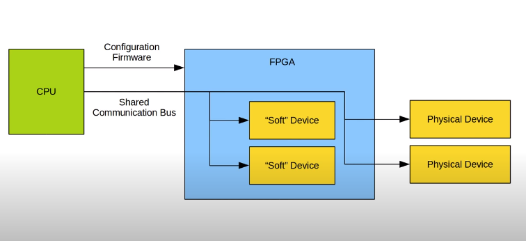

## Setting up Image for beagleboard black

### Need of programming FPGA from kernel instead from user space:

<p align="center">
    
</p>

### Adding information of hardware in boot config.txt:

- SPI Testing 

```
    sudo nano /boot/config.txt
    #This turns on the spi driver on the bus, it can see if there are any spi slave connected to the pins
    dtparam=spi=on    

    # For checking 
    ls /dev/spi*
    echo Hello > /dev/spi*
    #With DSO one can check the Hello message on the MOSI pin
```

- Adding Overlays into boot config for devices:

    Example of DTS file of ice40

```
    /dts-v1/;
    /plugin/;

    / {
    compatible="brcm,bcm2708";

    fragment@0 {
        target = <&spi0>;
        __overlay__ {
        status = "okay";

        spidev@0 {
            status = "disabled";
        };

        spidev@1 {
            status = "disabled";
        };
        };
    };

    fragment@1 {
        target = <&spi0>;

        __overlay__ {
        /* needed to avoid dtc warning */
        #address-cells = <1>;
        #size-cells = <0>;

        ice40: ice40@0 {
            compatible = "lattice,ice40-fpga-mgr";
        reg = <0>;
            spi-max-frequency = <10000000>;
            cdone-gpios = <&gpio 24 0>;
        reset-gpios = <&gpio 22 1>;
        };
        };
    };
```

- Compiling the dts file into binary <br>

    >  dtc -@ -I dts -O dtb -o ice40-overlay.dtbo ice40-overlay.dts 

- Adding Overlay in boot config file

    > sudo cp ice40-overlay.dtbo /boot/overlays/ice40-overlay.dtbo
    > dtoverlay=ice40-overlay   
    > sudo reboot

- FPGA Manager: Writes Bitstream to the FPGA

    ```
     sudo modprobe ice40-spi
     lsmod
     dmesg | tail
     cat /sys/class/fpga_manager/fpga0/name
     #Transfers the firmware
     sudo insmod fpga-test.ko
    ```